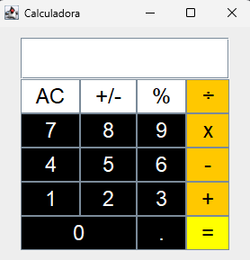

<h1 align="center">Calculadora</h1>

Criação de uma calculadora com interface gráfica, usando Swing e Java para a disciplina de POO.

  <a href="#-tecnologias">Tecnologia</a>&nbsp;&nbsp;&nbsp;|&nbsp;&nbsp;&nbsp;
  <a href="#-projetos">Projetos</a>&nbsp;&nbsp;&nbsp;|&nbsp;&nbsp;&nbsp;
  <a href="#memo-licença">Licença</a>

  

 

## 🚀 Tecnologias 

- Swing e Java
- Git e Github 

## 💻 Projeto

A ideia do projeto era desenvolver uma aplicação com interface gráfica.

## :memo: Licença

Esse projeto está sob a licença MIT.